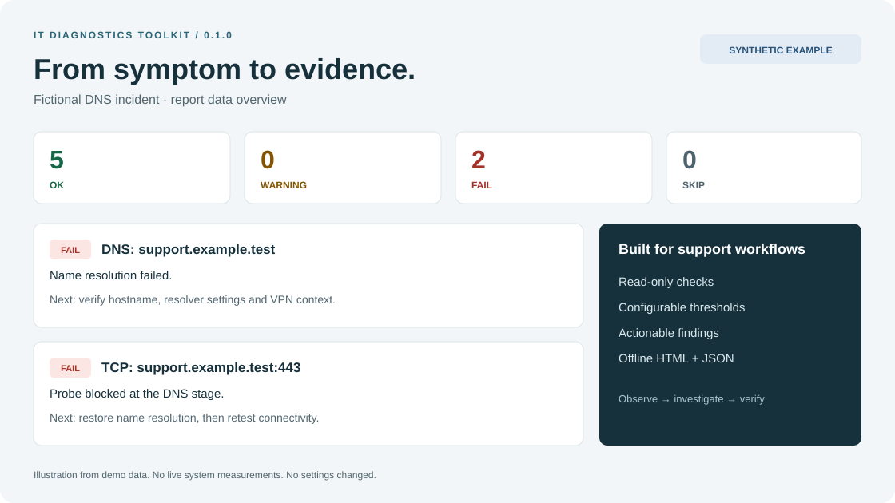

# IT Diagnostics Toolkit

**Read-only workstation diagnostics with clear findings, supporting evidence and practical next steps.**

A Python command-line tool for IT support and infrastructure troubleshooting. It checks local resource usage, selected service states and explicitly configured network destinations, then creates a self-contained HTML report and structured JSON.

Built as a portfolio project around a support workflow: **observe → collect evidence → narrow the cause → verify recovery**.



> The illustration and committed sample reports contain fictional data. They are demonstrations, not production incidents or measurements from a real customer. The illustration summarizes report data; it is not a browser screenshot.

## Features

- CPU sampling, available memory and filesystem capacity checks with configurable warning/failure thresholds.
- OS, architecture, CPU counts and uptime inventory where the operating system exposes them.
- Network interface link state, speed and MTU, without collecting interface IP/MAC addresses.
- Optional DNS resolution and TCP connection checks with bounded worker execution.
- Optional Windows service and Linux systemd service checks.
- `OK`, `WARNING`, `FAIL` and `SKIP` findings with evidence and suggested next steps.
- Offline HTML reports with severity filters, expandable evidence and responsive layout.
- JSON reports with a versioned schema, counts and coverage status.
- Five deterministic demo scenarios that do not inspect or change the host.
- Configurable exit codes for scripts and CI.
- Automated tests and a GitHub Actions matrix for Linux, Windows and macOS.

## Quick start

Requires **Python 3.10+**. Python 3.12 is a convenient starting point. Download or clone this repository, extract it if necessary, and open a terminal **inside the folder containing `pyproject.toml`**.

### Windows / PowerShell

```powershell
py -3 -m venv .venv
.\.venv\Scripts\python.exe -m pip install ".[dev]"
.\.venv\Scripts\python.exe -m it_diagnostics --demo dns-failure
```

No virtual-environment activation or PowerShell execution-policy change is needed. If `py` is not available, try `python --version`, then use `python -m venv .venv`.

### Linux / macOS

```bash
python3 -m venv .venv
.venv/bin/python -m pip install ".[dev]"
.venv/bin/python -m it_diagnostics --demo dns-failure
```

The terminal prints paths to two files inside `reports/`. Open the `.html` file in a browser. The `.json` file contains the same evidence for automation.

After installation, `itdiag` is also available from the virtual environment's `bin` or `Scripts` directory. Examples below use `python -m it_diagnostics`; substitute the virtual-environment Python path shown above.

## Run real diagnostics

```bash
python -m it_diagnostics
python -m it_diagnostics --config config.example.json
python -m it_diagnostics --config config.network.example.json
python -m it_diagnostics --format json --output-dir reports
```

The default run sends **no remote network probes** and checks no services. It measures the filesystem containing the current working directory's root. To check other volumes, set `disk_paths` in a configuration file.

The network example explicitly resolves `example.com` and attempts one TCP destination on port 443. Change these to the services relevant to your environment. A TCP handshake does not send an HTTP request or validate a TLS certificate.

### Configure thresholds and targets

Copy an example to `config.local.json` (ignored by Git), then edit it:

```json
{
  "cpu_sample_seconds": 0.5,
  "timeout_seconds": 3,
  "thresholds": {
    "cpu": {"warning": 85, "fail": 95},
    "memory": {"warning": 80, "fail": 95},
    "disk": {"warning": 80, "fail": 90}
  },
  "disk_paths": ["."],
  "dns_hosts": [],
  "tcp_targets": [],
  "services": []
}
```

`"."` is relative to the directory from which you run the command, not the configuration file's directory. Omit `disk_paths` to use the root of the current drive/filesystem. Examples:

- Windows: `"disk_paths": ["C:\\", "D:\\"]`
- Linux: `"disk_paths": ["/", "/var"]`
- macOS: `"disk_paths": ["/"]`

Configure exact service names **only for services expected to be running**:

```json
{
  "services": [
    {"name": "Spooler", "platform": "windows"},
    {"name": "ssh.service", "platform": "linux"}
  ]
}
```

The printer spooler and SSH server are examples; they are not required on every machine. Linux unit names vary by distribution (`ssh.service` vs. `sshd.service`). Checks for another platform return `SKIP`. Native macOS service checks are not implemented.

Unknown configuration keys, invalid ports, empty paths and reversed thresholds are rejected instead of silently ignored. Configuration supports at most 32 items per list.

## Interpret the results

| Status | Meaning |
| --- | --- |
| `OK` | This specific check completed without detecting its defined condition. |
| `WARNING` | A warning threshold or transitional service state was observed. |
| `FAIL` | A failure threshold, unavailable configured target, missing path or inactive required service was observed. |
| `SKIP` | The check was not configured, not applicable or could not be performed. Health is unknown. |

The overall result is the highest severity among completed checks. If all checks are skipped, it is `SKIP`. Any skipped check makes coverage `partial`; the console and HTML report show a visible notice. `OK` with partial coverage does **not** mean the whole computer is healthy.

Threshold comparisons are inclusive: disk utilization of exactly 80% warns and exactly 90% fails with the defaults. These are project defaults, not universal vendor recommendations.

### Exit codes

| Exit code | Meaning |
| --- | --- |
| `0` | Reports were written and the selected failure policy was not triggered. |
| `1` | Reports were written but `--fail-on` detected the requested severity. |
| `2` | Invalid arguments/configuration or a report-writing error. |

```bash
python -m it_diagnostics --fail-on fail
python -m it_diagnostics --fail-on warning
```

Default: `--fail-on none`. `SKIP` does not trigger `--fail-on`; automation that requires complete coverage should inspect the JSON `coverage` field.

## Demonstration scenarios

```bash
python -m it_diagnostics --demo healthy
python -m it_diagnostics --demo memory-pressure
python -m it_diagnostics --demo disk-full
python -m it_diagnostics --demo dns-failure
python -m it_diagnostics --demo service-down
```

Every demo is clearly marked **SYNTHETIC DATA**. Reports are deterministic except for output filenames. There is no need to fill a disk, exhaust memory, stop a service or break DNS.

- [Sample HTML report](examples/reports/dns-failure.html) — download and open locally; GitHub normally displays HTML source.
- [Sample JSON report](examples/reports/dns-failure.json).
- [Three troubleshooting walkthroughs](docs/CASE_STUDIES.md).

## Design

`CLI → validated config → collectors/checks → Report → HTML + JSON`

| Module | Responsibility |
| --- | --- |
| `config.py` | Validated settings, thresholds and explicit targets. |
| `checks.py` | Resource, interface, service and network checks. |
| `network_worker.py` | DNS/TCP probes in a subprocess so blocking resolution can be stopped. |
| `models.py` | Shared findings and report schema. |
| `reporting.py` | Escaped, offline HTML and JSON serialization. |
| `demo.py` | Fictional, repeatable incident examples. |
| `cli.py` | Arguments, execution, report paths and exit codes. |

See [architecture and trade-offs](docs/ARCHITECTURE.md) for implementation decisions.

## Tests and validation

```bash
python -m pip install ".[dev]"
python -m pytest -q
```

Tests cover threshold boundaries, invalid configuration, unavailable metrics, service adapters, report escaping, exit codes and a real loopback TCP connection. Tests do not require public Internet access, admin rights or installed production services. Service-state cases use mocked OS adapters.

The included GitHub Actions workflow is configured for Python 3.10, 3.12 and 3.14 on Ubuntu, Windows and macOS. It will run after publication. **A configured matrix is not evidence that every platform has already passed.** See [the validation record](docs/VALIDATION.md) for what was actually exercised before publication.

For source edits, install in editable mode with `python -m pip install -e ".[dev]"`.

## Scope and privacy

- The program writes reports but does not change settings, restart services, delete data or perform remediation.
- Hostnames, usernames, serial numbers, process command lines and interface IP/MAC addresses are not collected. Configured targets, paths, interface names and service names are included in reports and may still be sensitive.
- `reports/`, local configuration and virtual environments are ignored by Git. Commit fictional examples rather than live workstation reports.
- DNS requests use the OS resolver. TCP probes contact only configured destinations. There is no telemetry, port-range scanning or background agent.
- CPU and memory are snapshots, not continuous monitoring. Container metrics may reflect the host rather than container limits.
- Disk checks measure filesystem capacity, **not SMART status, bad sectors or physical hardware health**.
- Interface link state may include loopback. It does not prove gateway reachability or Internet access.
- DNS success does not prove application availability. TCP success does not prove HTTP, TLS or business-function health.
- Linux services require an active systemd manager; unsupported environments produce `SKIP`. Permission restrictions and unavailable OS counters are reported, not bypassed.

## Documentation

- [GitHub publication guide in Russian](docs/GITHUB_SETUP_RU.md)
- [Troubleshooting](docs/TROUBLESHOOTING.md)
- [Case studies](docs/CASE_STUDIES.md)
- [Architecture](docs/ARCHITECTURE.md)
- [Official references](docs/SOURCES.md)

## Future improvements

- Opt-in HTTP status and verified TLS certificate checks.
- Baseline comparison between two diagnostic reports.
- Native macOS service adapter.
- Additional hardware-specific checks with clearly documented permissions.

These are planned ideas, not implemented features.

## License

MIT. See [LICENSE](LICENSE).
